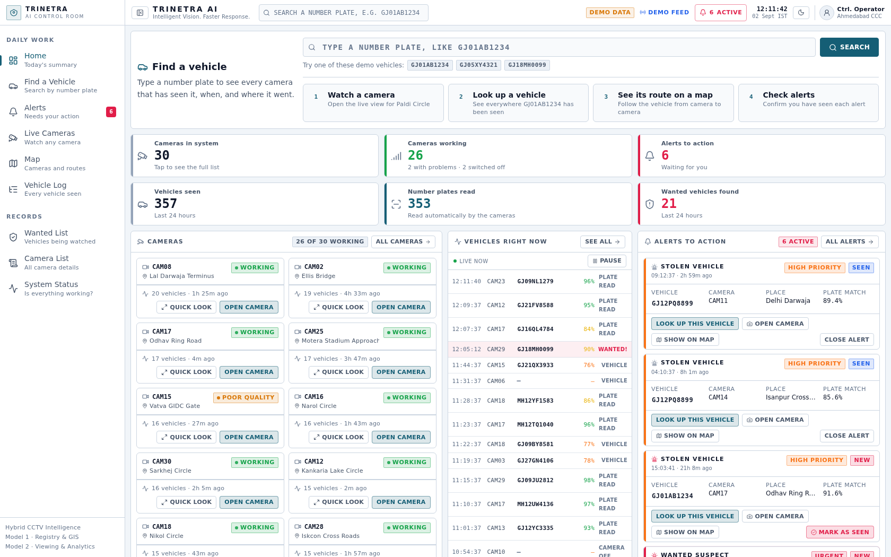
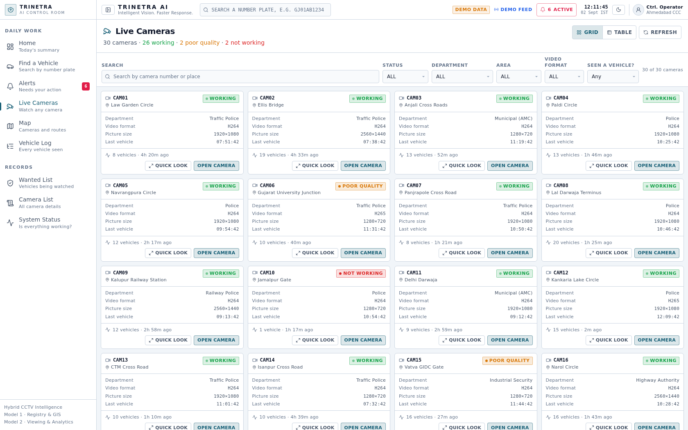
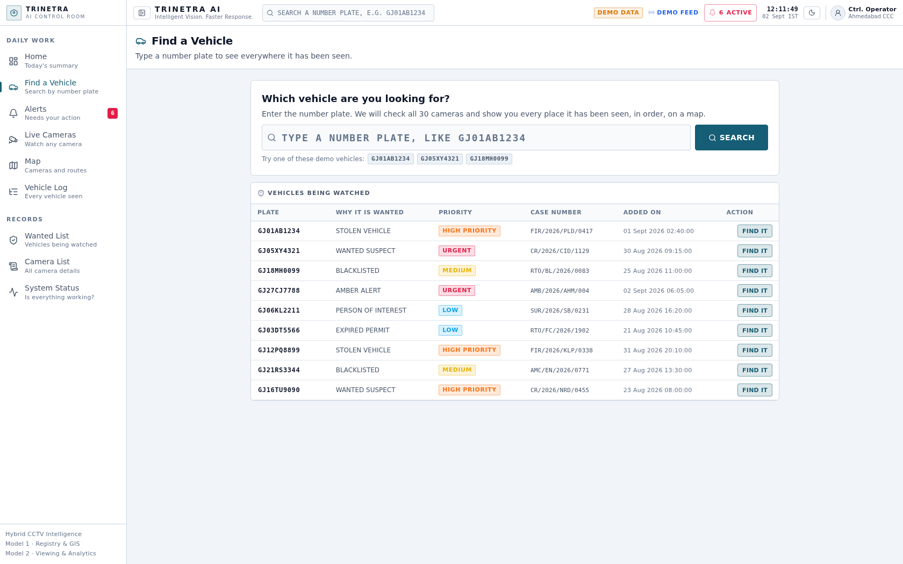
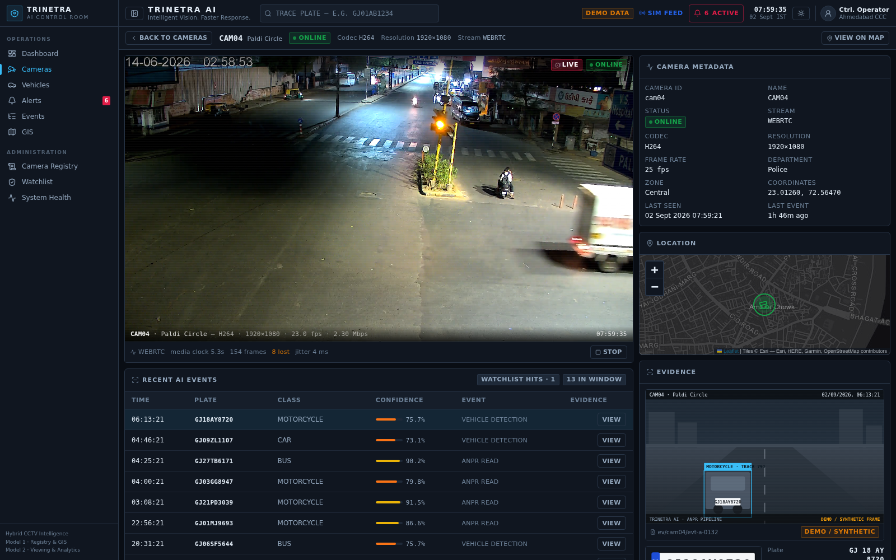
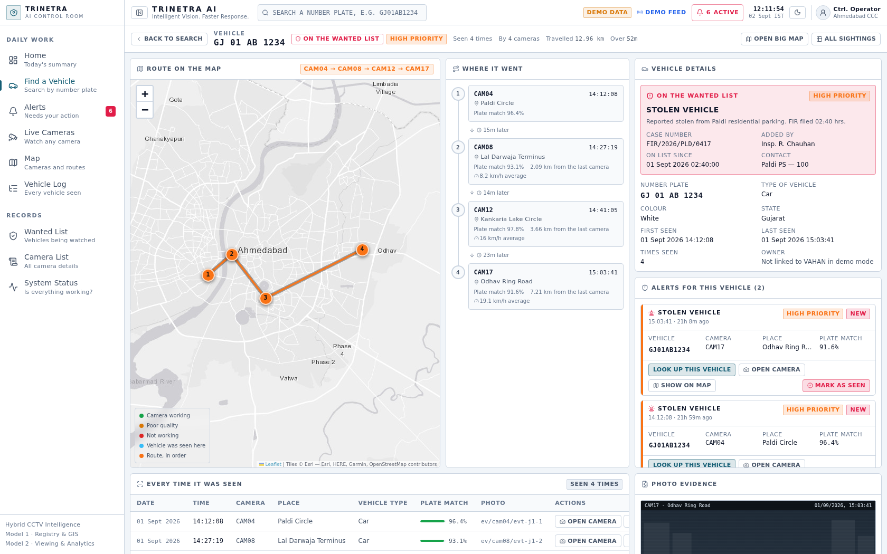
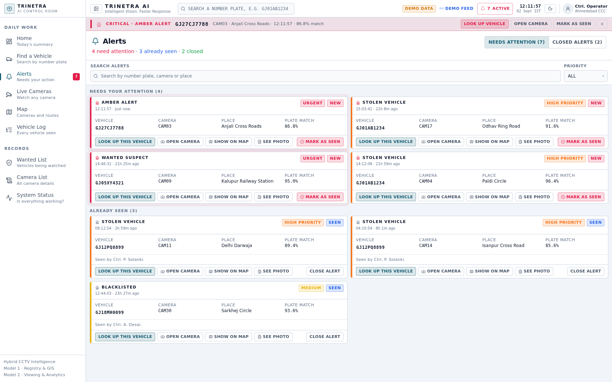
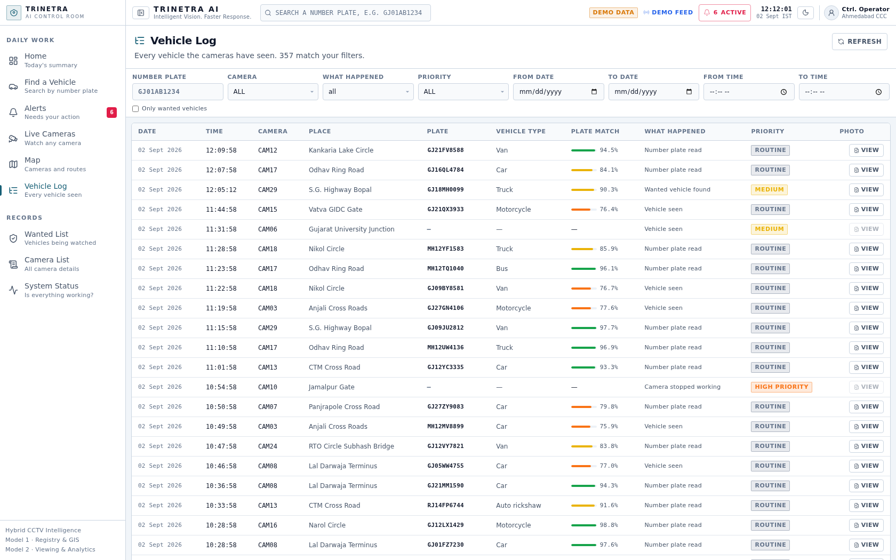
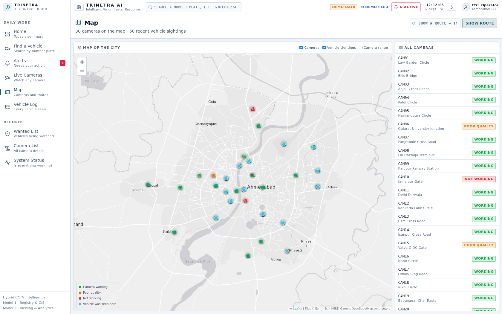
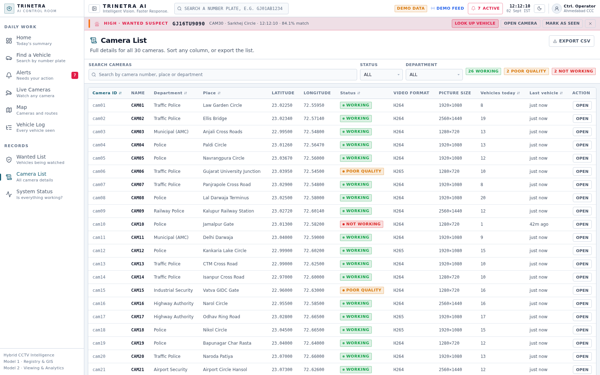
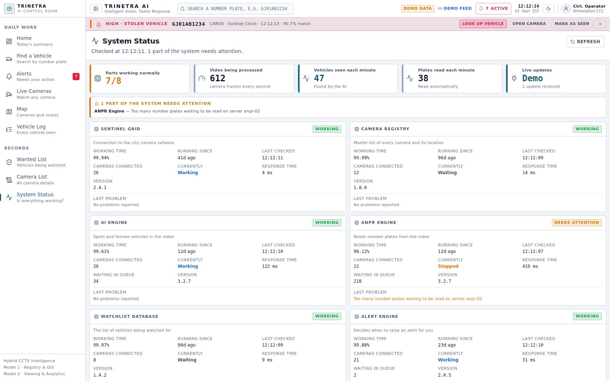

# TRINETRA AI

**Intelligent Vision. Faster Response.**

Frontend for a hybrid CCTV Intelligence & Investigation control room — camera network monitoring,
AI vehicle detection, ANPR, watchlist matching, real-time alerting and chronological cross-camera
route reconstruction on a live GIS map.

The whole product runs **without a backend** (mock mode) and switches to real APIs with a single
environment variable.

---

## 1. Quick start

```bash
npm install
npm run dev          # http://localhost:5173  (mock mode by default)
```

Other scripts:

| Script              | Purpose                                  |
| ------------------- | ---------------------------------------- |
| `npm run dev`       | Vite dev server (host 0.0.0.0)           |
| `npm run build`     | Typecheck (`tsc -b`) + production bundle |
| `npm run preview`   | Serve the production build               |
| `npm run typecheck` | Types only, no emit                      |
| `npm run lint`      | oxlint over `src/`                       |

---

## 2. The 60-second demo (works in mock mode)

The Command Center carries a **Guided demo** strip that follows exactly this path:

1. **Dashboard** — KPIs, camera network, live event feed, active alerts, GIS preview.
2. **Open CAM04** (Paldi Circle) — camera detail, on-demand stream area, recent AI events.
3. **Click plate `GJ01AB1234`** — jumps straight into the investigation workspace.
4. **Watchlist match** — `STOLEN VEHICLE`, severity `HIGH`, case `FIR/2026/PLD/0417`.
5. **Sightings** — `14:12:08 CAM04 → 14:27:19 CAM08 → 14:41:05 CAM12 → 15:03:41 CAM17`.
6. **View on Map** — Leaflet route with numbered, chronological hops.
7. **Click a route point** — camera, timestamp, confidence, travel gap, distance, average speed.
8. **Evidence** — CCTV frame + plate crop (clearly watermarked *DEMO / SYNTHETIC*).
9. **Back to Alerts** — the alert stays visible; acknowledge/resolve moves it through its lifecycle.

Two more journeys are seeded for variety: `GJ05XY4321` (wanted suspect, CRITICAL) and
`GJ18MH0099` (blacklisted goods carrier, MEDIUM).

---

## 3. Screenshots

All captured from the running app in the default **light** theme, except the camera-detail
shot, which was taken in dark mode in a Chrome build with an H.264 decoder so the real
Sentinel video is visible.

| | |
|---|---|
| Home — Command Center |  |
| Live Cameras grid |  |
| Find a Vehicle (hero search) |  |
| Camera detail + **live video** |  |
| Vehicle investigation workspace |  |
| Alerts + lifecycle actions |  |
| Vehicle Log (event explorer) |  |
| Map — GIS route visualisation |  |
| Camera List (registry) |  |
| System Status |  |

## 4. Architecture

```
src/
├── app/           App shell, router (lazy routes), providers, route error boundary
├── layouts/       MainLayout (sidebar + header + alert banner), InvestigationLayout
├── pages/         One file per route
├── components/    layout · camera · vehicle · alerts · gis · events · dashboard · common
├── features/      Cross-cutting state (alerts/LiveProvider, system/Theme + Toast)
├── services/      API contract: api, cameraService, vehicleService, alertService,
│                  eventService, systemService, realtimeService
├── hooks/         useCameras, useVehicleSearch, useAlerts, useLiveEvents, useEvents, useAsync, useUi
├── types/         camera · vehicle · event · alert · system
├── mocks/         Synthetic registry, events, alerts, watchlist, health + mockBackend
├── data/          Demo walkthrough definition
├── lib/           config (env), utils (formatting, severity tokens, geo maths)
└── utils/         Synthetic evidence generator (SVG data URIs)
```

**Rules that keep the frontend replaceable:**

- Components never call axios. They call **hooks**, hooks call **services**, services choose
  mock or HTTP. Swapping the backend touches nothing above `services/`.
- `mocks/mockBackend.ts` implements the *same signatures* as the HTTP layer, including
  simulated latency, so loading/error states are exercised in the demo.
- Realtime is one abstraction (`services/realtimeService.ts`) with three implementations:
  mock simulator, SSE, WebSocket (with reconnect). `useLiveEvents()` never changes.

---

## 5. API contract

The backend is expected to expose:

| Method | Endpoint                      | Returns                                       |
| ------ | ----------------------------- | --------------------------------------------- |
| GET    | `/api/cameras`                | `Camera[]`                                    |
| GET    | `/api/cameras/{id}`           | `Camera`                                      |
| GET    | `/api/cameras/{id}/stream`    | `CameraStreamTicket` (short-lived signed URL) |
| GET    | `/api/events`                 | `Paginated<VehicleEvent>` (filters + paging)  |
| GET    | `/api/events/{id}`            | `VehicleEvent`                                |
| GET    | `/api/vehicles/{plate}`       | `VehicleProfile`                              |
| GET    | `/api/vehicles/{plate}/events`| `VehicleEvent[]`                              |
| GET    | `/api/vehicles/{plate}/route` | `VehicleRoute`                                |
| GET    | `/api/watchlist`              | `WatchlistRecord[]`                           |
| GET    | `/api/alerts`                 | `Alert[]`                                     |
| POST   | `/api/alerts/{id}/ack`        | `Alert`                                       |
| POST   | `/api/alerts/{id}/resolve`    | `Alert`                                       |
| GET    | `/api/health`                 | `SystemSummary`                               |
| GET    | `/api/stats/kpis`             | `DashboardKpis`                               |
| SSE    | `/api/stream`                 | `RealtimeMessage` frames                      |
| WS     | `/api/ws`                     | `RealtimeMessage` frames                      |

Realtime frame shape:

```ts
type RealtimeMessage =
  | { type: 'EVENT';  payload: VehicleEvent }
  | { type: 'ALERT';  payload: Alert }
  | { type: 'CAMERA_STATUS'; payload: { cameraId: string; status: CameraStatus } };
```

Filter/paging query params for `/api/events`: `plate, cameraId, eventType, severity, dateFrom,
dateTo, timeFrom, timeTo, watchlistOnly, page, pageSize`.

---

## 6. Configuration

`.env` (see `.env.example`) — **browser-safe values only**:

```dotenv
VITE_USE_MOCKS=true          # false → use the real backend
VITE_API_BASE_URL=/api       # same-origin proxy recommended
VITE_REALTIME_TRANSPORT=sse  # sse | ws | off
VITE_MAP_CENTER_LAT=23.0225
VITE_MAP_CENTER_LNG=72.5714
VITE_MAP_DEFAULT_ZOOM=13
```

Going live:

```bash
VITE_USE_MOCKS=false BACKEND_ORIGIN=http://localhost:8000 npm run dev
```

`BACKEND_ORIGIN` (no `VITE_` prefix — it is read by `vite.config.ts` on the Node side,
never compiled into the bundle) is dev-only and configures the Vite proxy for `/api`, so the browser
always talks to the same origin (no CORS, no hard-coded hosts in client code).

---

## 7. Sentinel integration & security

The Sentinel catalogue (`https://cctv.corp8.cloud/cameras.json`) is **password protected** and is
never contacted from the browser. The flow is:

```
Sentinel  ──►  Trinetra backend (holds the credential)  ──►  GET /api/cameras  ──►  frontend
```

- No password, token or private key exists in this repository or in the built bundle.
  Anything prefixed `VITE_` is public by definition and is limited to URLs and feature flags.
- Playback URLs arrive as **short-lived signed tickets** from `/api/cameras/{id}/stream`.
  The player renders whatever URL it is handed and never constructs an authenticated one.
- `services/api.ts` exposes `setAuthToken()` so a session token can be injected at runtime
  (login response or cookie exchange) without rebuilding.
- Errors are normalised through `ApiError`; request bodies and headers are never logged.

---

## 8. Live video — Sentinel camera grid

The control room plays **real live video** from the Sentinel grid. Nothing about
the player is simulated.

### Transport choice

| Protocol | Endpoint | Why we do / don't use it |
|---|---|---|
| RTSP | `rtsp://<gateway>:8554/stream/<id>` | Not playable in a browser. Correct choice for AI inference (OpenCV/GStreamer/FFmpeg). |
| HLS | `https://cctv.corp8.cloud/<id>/index.m3u8` | CDN host sits behind the Sentinel **access password**; the frontend holds no credentials, so it cannot fetch this directly. |
| **WebRTC (WHEP)** | `POST /sentinel/stream/<id>/whep` | **What the UI uses.** Browser-native, sub-second, no plugin, no credentials. |

### How the request flows

```
browser ──POST /sentinel/stream/cam04/whep (same-origin, HTTPS)
        └─> dev server / reverse proxy  ──> Sentinel gateway :8889
            (adds:  Authorization: Basic base64(email:password))
            (SENTINEL_WHEP_ORIGIN + SENTINEL_EMAIL/PASSWORD, server-side only)
```

Proxying is not cosmetic — it solves four real problems at once:

* **Mixed content.** The gateway speaks plain HTTP on a bare IP; a page served
  over HTTPS may not call it. Same-origin `/sentinel/*` sidesteps the block.
* **CORS.** No preflight failures, because there is no cross-origin request.
* **Auth.** The integrator guide requires WebRTC/WHEP to authenticate **every**
  connection with your registered email + access password. Browsers strip
  `user:pass@` from cross-origin fetch URLs, so embedding them would not work —
  instead the proxy injects the equivalent `Authorization: Basic` header
  server-side on every `/sentinel` request.
* **Secrets.** `SENTINEL_WHEP_ORIGIN`, `SENTINEL_EMAIL` and `SENTINEL_PASSWORD`
  have **no `VITE_` prefix**, so none of them is ever compiled into the public
  bundle. The browser never learns the gateway origin or the credentials.

All three `SENTINEL_*` variables are read from `trinetra-ai/.env` (server-side
only — see `.env.example`) or the shell environment; real shell env wins. The
proxy rewrites the path from `/sentinel/stream/<id>/whep` to the gateway's
`/stream/<id>/whep`, and the WHEP `201 Location` header (relative or absolute)
back onto our origin so the client can `DELETE` its session on teardown and
free gateway capacity.

### Compliance with the integrator's checklist

| Guide rule | Where it is implemented |
|---|---|
| Force RTSP over TCP; remote clients use HLS | N/A in-browser — we use WHEP, the browser-native transport. RTSP/TCP stays the documented path for AI inference. |
| Don't trust the reported frame rate | `useWhepStream` measures fps from `framesDecoded` deltas via `getStats()`. The OSD shows the **measured** rate, never the catalogue value. |
| Drive timing from PTS, not arrival time | Timing comes from the media clock (`video.currentTime` / RTP stats), shown as "media clock" in the footer. |
| Don't assume a constant frame rate | Inter-frame gaps are tolerated; a stall is only declared after 6 s of no decoded frames. |
| Reconnect with backoff (~2 s → 30 s) | `backoffDelay()` — exponential with jitter, capped at 30 s. Attempt counter is surfaced in the UI. Never a tight loop. |
| Join-time decoder warnings are not fatal | Logged at `info`, never surfaced as an error. The player waits for the first IDR instead of failing. |
| Expect a scene discontinuity at the loop point | Resolution changes are counted and displayed as "N scene cuts"; long-lived state is not reset. |
| No footage download — build against live capture | There is no download path; every frame is consumed live. |
| Pace your load; open only what you process | The camera grid pulls **zero** streams. A feed opens only on explicit operator action, and `Stop` / unmount / camera-switch `DELETE`s the session. Hidden tabs pause. |
| Read the camera list from the catalogue | `cameras.json` is password-gated, so the app reads its registry from `GET /api/cameras`, which is exactly where a backend would republish the catalogue. |
| Handle mixed H.264 / H.265 and resolutions | Codec support is probed with `RTCRtpReceiver.getCapabilities()` **before** negotiating. Resolution is read from the live decoder, not assumed. |

### What you will actually see

The grid really is mixed, and the UI is honest about each case:

* **H.264 cameras** (24 of 30) play live, typically within a few seconds.
* **H.265 cameras** — `cam06`, `cam12`, `cam17`, `cam18`, `cam22`, `cam26` —
  cannot be decoded over WebRTC by most browsers. The player detects this up
  front and explains it instead of retrying forever; RTSP remains available for
  inference.
* **Slow-keyframe sources.** A live camera cannot be asked to emit a keyframe on
  demand. If a source is mid-GOP the player shows `Waiting for keyframe… 12s`
  with bytes received and keyframe requests sent, and keeps the session open
  rather than restarting the wait.

### Turning it off

`VITE_LIVE_STREAMS=false` reverts the player to synthetic demo frames — useful
for offline demos or when the gateway is unreachable. Everything else in the app
is unaffected.

## 9. Performance notes

- **Streams are opt-in.** Nothing auto-plays. The camera grid renders metadata cards only;
  a feed starts when an operator presses *Start Stream* or opens a detail page. 30 concurrent
  feeds are never mounted.
- Routes and the map/chart bundles are **code-split** (`React.lazy`); Leaflet loads only on
  screens that draw a map.
- The event pool is queried **server-side style** with pagination (25 rows/page) — the table
  never renders thousands of rows.
- `CameraCard`, `EventRow` and the charts are memoised; the live feed keeps a bounded 60-event
  ring buffer and can be paused by the operator.

---

## 10. Mock data

| Dataset            | Volume                                                             |
| ------------------ | ------------------------------------------------------------------ |
| Cameras            | 30 real Ahmedabad junctions with GIS coordinates, codecs, zones     |
| Vehicle events     | ~350 across 24 h, including 13 journey sightings                    |
| Alerts             | 8 (new / acknowledged / resolved) covering the full lifecycle       |
| Watchlist          | 10 records across 6 categories and all severities                   |
| Tracked journeys   | 3, led by `GJ01AB1234`                                              |

Data is deterministic (seeded PRNG) so every reload of the demo looks the same, and demo clock
times (14:12:08 …) always resolve to the most recent past occurrence. Evidence imagery is
generated locally as inline SVG and watermarked **DEMO / SYNTHETIC** so it can never be mistaken
for real material.

---

## 11. Accessibility & responsiveness

Semantic landmarks, skip link, labelled controls, `aria-live` alert regions, visible focus rings,
keyboard-operable dialogs (Esc to close), and `aria-sort` on sortable registry columns.
Desktop-first with graceful degradation: sidebar collapses under 1024 px, panels stack, camera
grid drops to 1–2 columns, tables scroll horizontally. **Light theme is the default**; dark
theme is a one-click toggle and is persisted.

### Plain language

Every screen is written for an officer on shift, not for an engineer. Machine codes stay in the
API and the data layer; the interface says what happened in words:

| API / data layer | What the officer reads |
|---|---|
| `VEHICLE_DETECTION`, `ANPR_READ`, `WATCHLIST_MATCH` | Vehicle seen, Number plate read, Wanted vehicle found |
| `HEALTHY`, `DEGRADED`, `OFFLINE` | Working, Needs attention / Poor quality, Not working |
| `NEW`, `ACKNOWLEDGED`, `RESOLVED` | Needs your attention, Already seen, Closed |
| Trace / plot route / GIS route | Find a vehicle, Show route, Route on the map |
| Confidence, codec, resolution, ingest throughput | Plate match, Video format, Picture size, Video being processed |
| `AUTO_RICKSHAW` | Auto rickshaw |

Technical detail is never deleted, only demoted: the camera player keeps a **Show technical
details** toggle (codec, PTS clock, decoded/lost frames, jitter) for whoever needs it.

---

## 12. Verification status

Last full pass on this build:

| Check | Result |
|---|---|
| `npm run typecheck` | clean |
| `npm run build` | success, code-split bundles |
| `npm run lint` | 0 errors (16 react-refresh warnings) |
| All 13 routes | render, no broken links |
| Browser console | 0 JS errors, 0 failed requests |
| Automated flow suite | **51/51 assertions pass** — every route, the full 15-step vehicle trace, alert lifecycle, event filters + pagination, camera stream discipline, dark theme, plain-language scan, secret scan |
| Plain-language scan | no `HEALTHY`/`DEGRADED`/`ANPR`/`codec`/raw enum strings rendered on any officer-facing screen |
| Secret scan of `src/` and `dist/` | no credentials, keys or tokens; gateway origin absent from the bundle |
| Live WebRTC playback | verified in Google Chrome against the real gateway — 1920×1080 H.264, measured 23–25 fps, ~2.2 Mbps |
| Mixed-codec handling | H.265 cameras refuse up front with an explanation; no retry loop |
| Slow-keyframe handling | session held open with live diagnostics instead of restarting the wait |
| Breakpoints checked | 1680 / 1500 / 900 / 414 px, dark + light |
